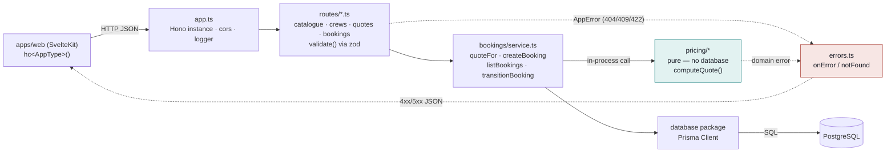
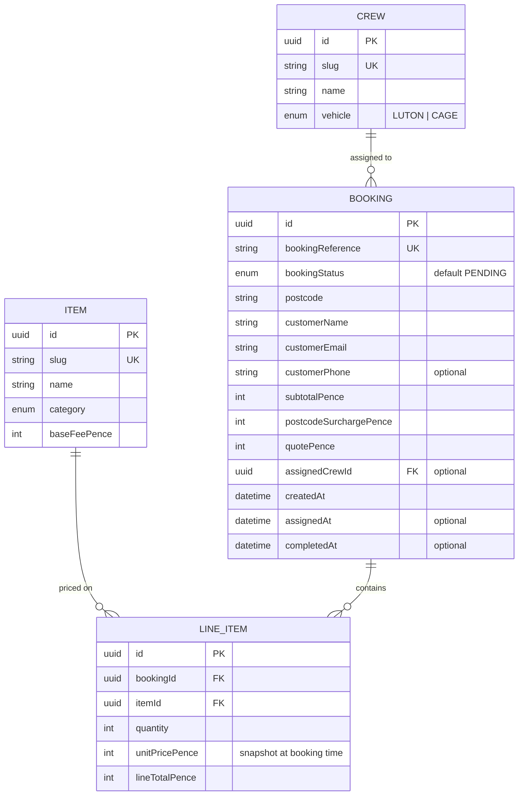
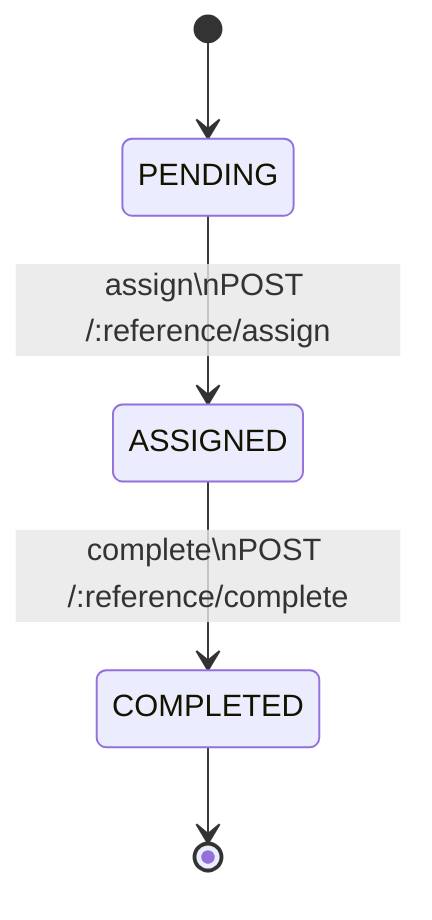
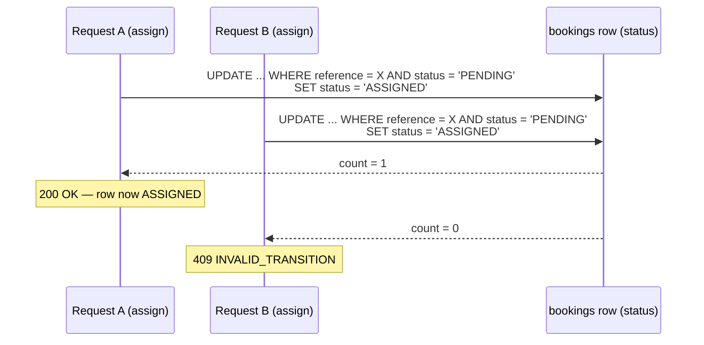
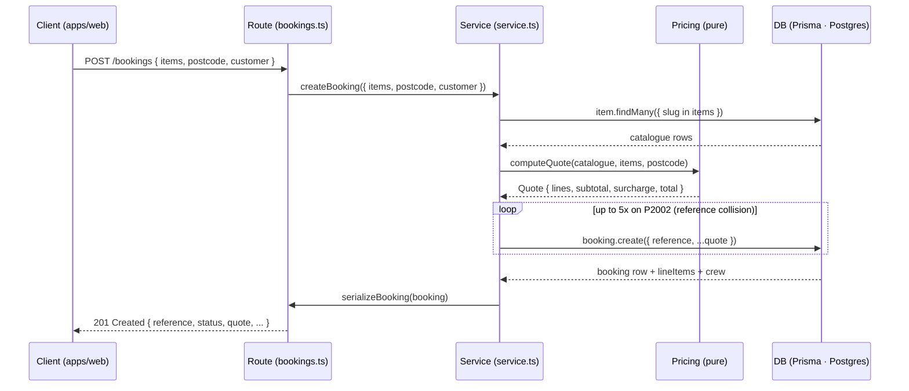
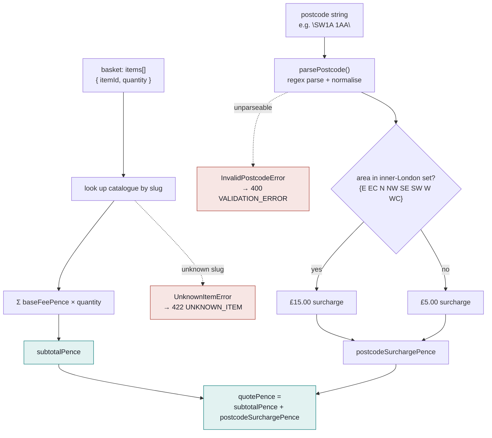

# Van Booking Engine

A man-and-van booking service: `Hono` for routing, `zod` for validation, a pure pricing module with no
database access, and `Prisma` over Postgres for everything that has to persist. The four diagrams below
trace how a basket and a postcode become a priced, tracked job.

Source: `apps/api/src/` (routes, `bookings/`, `pricing/`, `errors.ts`, `schemas.ts`) and
`packages/database/prisma/schema.prisma`.

## 1. Request pipeline

Every request passes through the same five stages. `pricing/*` is drawn apart from the rest — it never
imports `database`, so `computeQuote()` can be unit-tested with zero I/O. Anything thrown anywhere lands
in one place: `errors.ts`.

> **Why:** keeping `pricing/*` free of database calls means the £/postcode math is tested as plain
> functions (`quote.test.ts`, `surcharge.test.ts`) — no test database, no mocking Prisma.

## 2. Data model

Four tables. `LineItem` is a frozen snapshot — it copies `unitPricePence` off `Item` at booking time, so
a later catalogue price change never rewrites a past invoice.

## 3. Booking lifecycle

Three states, one direction: `PENDING → ASSIGNED → COMPLETED`. Nothing moves backwards and there's no
cancel — the whole shape lives in one lookup table in `transitions.ts`.

`transitionBooking()` never reads the status before writing it — it applies the transition as a single
conditional `UPDATE`, then checks how many rows it touched:

> **Why:** writing conditionally and checking `count` afterwards means two racing requests can't both
> think they succeeded — no read-then-write gap for a double-assignment to slip through.

## 4. Creating a booking

The client never sends a price — the server always recomputes it from the catalogue. The insert loops
on its own unique reference: a collision just means drawing another six-character code.

`computeQuote()` itself is arithmetic plus one lookup: sum the basket, then price the postcode. All
integer pence throughout — no floating point, so nothing to round or drift.

